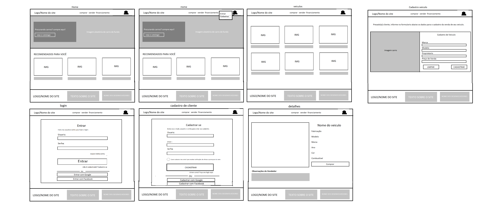

# Site Loja de Veiculos
Projeto desenvolvido em Angular para uma atividade. Com o intuito de simular uma loja fictícia de veículos integrado a uma API que realiza o cadastro destes veiculos e os clientes.

Observações: Esta atividade pedia que tivesse o site e o aplicativo, quanto ao site postado aqui, eu fiquei responsável pela parte dos códigos e estrutura, enquanto meu colega ficou responsável pelas informações, imagens etc...

WireFrame Inicial:

</img>

Resultado final:
## Home 

## Icone Perfil

## Aba "Comprar"

## Entrar

## Cadastrar

## Aba "Vender"

## Footer exposto em todas as páginas

